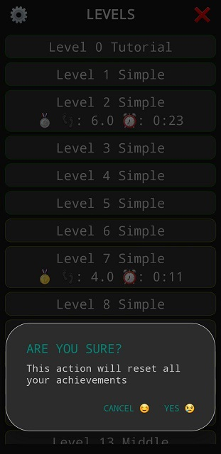
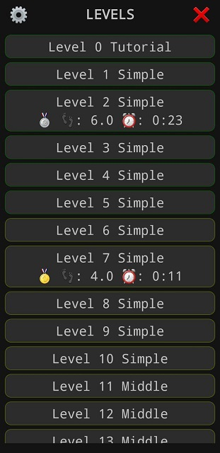
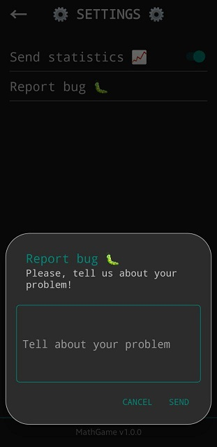

# Описание графического языка

## Содержание
- [Назначение](#назначение)
- [Описание состояний](#описание-состояний)
  - [Уровни](#уровни)
  - [Настройки](#настройки)
  - [Игра](#игра)
- [Описание UI](#описание-ui)
  - [Состояние "Уровни"](#состояние-уровни)
  - [Состояние "Настройки"](#состояние-настройки)
  - [Состояние "Игра"](#состояние-игра)
## Назначение
Назначение игры представим с помощью диаграммы использования:  


  
А для корректного взаимодействия пользователя и игры нам необходим удобный графический язык UI.  
Последний и будет описан ниже!

## Описание состояний
Приложение состоит из 3 экранов:
* экран уровней (он же стартовый)
* экран настроек
* игровой экран  

Таким образом, приложение может находиться в 5 глобальных состояниях, 3 из которых внутриигровые:
  

  
Далее рассмотрим как происходит взаимодействие с пользователем во всех внутриигровых
глобальных состояниях.

### Уровни

Рассмотрим более детально взаимодействие игрока и приложения в глобальном состоянии "Уровни":
  


На данной диаграмме рассмотрены 4 локальных состояния:
* [Авторизация](#авторизация) (Необходима только при первом запуске приложения)
* [Тотальный сброс](#тотальный-сброс) (При желании сбросить все свои достижения)
* [Просмотр уровней](#просмотр-уровней) (Основное локальное состояние)
* [Выбор уровня](#выбор-уровня)

### Настройки
// TODO
### Игра
// TODO

## Описание UI
### Состояние "Уровни"
#### Авторизация
* Здесь представлены поля для заполнения
  * Обязательные поля - красные с "!"
  * Необязательные - бирюзовые
* Затемненный задний фон не активен
* Кнопки "exit" и "sign in" - кнопки для выхода и регистрации соответственно


#### Тотальный сброс
* Затемненный задний фон не активен
* Кнопки "cancel" и "yes" - кнопки для отказа и согласия соответственно


#### Просмотр уровней
* Помимо просмотра названий уровней, после прохождения оных можно наблюдать
  картину результатов прохождения (медалька, количество шагов и время)
* Уровни сортируются по сложности и обводяться соответсвтующими цветами:
  * легкие - зеленый
  * средние - желтый
  * сложные - красный
  * интригующе сложные - бордовый
* Красный крестик - кнопка для перехода в состояние [Тотальный сброс](#тотальный-сброс)
* Шестеренка - кнопка для перехода в глобальное состояние [Настройки](#настройки)


#### Выбор уровня
* Выбранный уровень под пальцем пользователя обводится бирюзовым



### Состояние "Настройки"

#### Просмотр настроек

#### Оценивание

#### Отправка бага


### Состояние "Игра"

#### Начало игры
#### Время на исходе
#### Победа
#### Поражение
#### Базовое
#### Выбор подформулы
#### Выбор правила
#### Конечная формула спрятана
#### Назад в меню
#### Перезапуск
#### Шаг назад
