# Описание графического языка

## Содержание
- [Назначение](#назначение)
- [Описание состояний](#описание-состояний)
  - [Уровни](#уровни)
  - [Настройки](#настройки)
  - [Игра](#игра)
- [Описание UI](#описание-ui)
  - [Уровни - UI](#уровни-ui)
  - [Настройки - UI](#настройки-ui)
  - [Игра - UI](#игра-ui)
## Назначение
Назначение игры представим с помощью диаграммы использования:  


  
А для корректного взаимодействия пользователя и игры нам необходим удобный графический язык UI.  
Последний и будет описан ниже!

## Описание состояний
Приложение состоит из 3 экранов:
* экран уровней (он же стартовый)
* экран настроек
* игровой экран  

Таким образом, приложение может находиться в 5 глобальных состояниях, 3 из которых внутриигровые:
  

  
Далее рассмотрим как происходит взаимодействие с пользователем во всех внутриигровых
глобальных состояниях.

### Уровни

Рассмотрим более детально взаимодействие игрока и приложения в глобальном состоянии "Уровни":
  


На данной диаграмме рассмотрены 4 локальных состояния:
* [Авторизация](#авторизация) (Необходима только при первом запуске приложения)
* [Тотальный сброс](#тотальный-сброс) (При желании сбросить все свои достижения)
* [Просмотр уровней](#просмотр-уровней) (Основное локальное состояние)
* [Выбор уровня](#выбор-уровня)

### Настройки

Рассмотрим более детально взаимодействие игрока и приложения в глобальном состоянии "Настройки":



На данной диаграмме рассмотрены 4 локальных состояния:
* [Просмотр настроек](#просмотр-настроек) (Основное локальное состояние)
* [Оценивание](#оценивание)
* [Отправка бага](#отправка-бага)
* [Возврат в меню](#возврат-в-меню)

### Игра

Рассмотрим более детально взаимодействие игрока и приложения в глобальном состоянии "Игра":



На данной диаграмме рассмотрены 9 локальных состояний:  
* [Загрузка](#загрузка) (Необходима только один раз в рамках одной сессии использования приложения)
* [Базовое](#базовое) (Основное локально состояние)
* [Выбор подформулы](#выбор-подформулы)
* [Выбор правила](#выбор-правила)
* [Назад в меню](#назад-в-меню)
* [Перезапуск](#перезапуск)
* [Шаг назад](#шаг-назад)
* [Победа](#победа)
* [Поражение](#поражение)

## Описание UI
### Уровни - UI
#### Авторизация
* Здесь представлены поля для заполнения
  * Обязательные поля - красные с "!"
  * Необязательные - бирюзовые
* Затемненный задний фон не активен
* Android кнопка "назад" не активна
* Кнопки "exit" и "sign in" - кнопки для выхода и регистрации соответственно

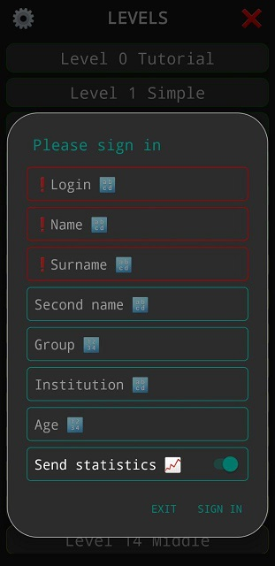
#### Тотальный сброс
* Кнопки "cancel" и "yes" - кнопки для отказа и согласия соответственно
* Нажатие на затемненный задний фон аналогично нажатию на "cancel"
* Нажатие на Android кнопку "назад" аналогично нажатию на "cancel"


#### Просмотр уровней
* Помимо просмотра названий уровней, после прохождения оных можно наблюдать
  картину результатов прохождения (медалька, количество шагов и время)
* Уровни сортируются по сложности и обводяться соответсвтующими цветами:
  * легкие - зеленый
  * средние - желтый
  * сложные - красный
  * интригующе сложные - бордовый
* Красный крестик - кнопка для перехода в состояние [Тотальный сброс](#тотальный-сброс)
* Шестеренка - кнопка для перехода в глобальное состояние [Настройки](#настройки)


#### Выбор уровня
* Выбранный уровень под пальцем пользователя обводится бирюзовым

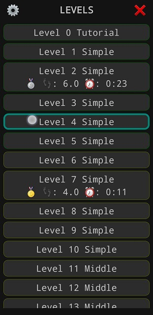

### Настройки - UI

#### Просмотр настроек
Пока что в настройках можно:
* Выбрать отправлять статистику на сервер али нет бирюзовым рычажком
* Отправить сообщение об ошибке нажатием на милую гусеницу
* Отправить оценку приложения (от 0 до 5 с шагом 0.5 aka "10-балльная система")
  * Выбрать оценку можно ведением по звездочкам (если игрок пребывает в размышлениях)
  * Либо просто нажатием на нужное количество
* Посмотреть версию приложения в самом низу экрана
* Вернуться в меню уровней с помощью
  * белой стрелочки
  * Android кнопки "назад" 
  
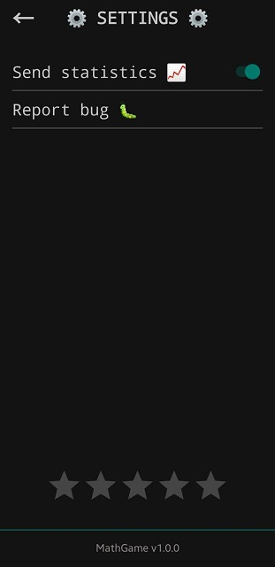
#### Оценивание
* Оценку можно менять и на данном этапе!
* В поле вводится любой комментарий к оценке, который игрок сочтет нужным
* Кнопки "cancel" и "send" предназначены для отказа от действия и отправки оценки соответственно
* Нажатие на затемненный фон либо Android кнопку "назад" равносильно "cancel"


#### Отправка бага
* В поле вводится любой комментарий, который игрок сочтет нужным
* Кнопки "cancel" и "send" предназначены для отказа от действия и отправки ошибки соответственно
* Нажатие на затемненный фон либо Android кнопку "назад" равносильно "cancel"


#### Возврат в меню
* Белая стрелочка под пальцем пользователя обводится бирюзовым
* На данном скриншоте можно увидеть отображение отказа от сбора статистики

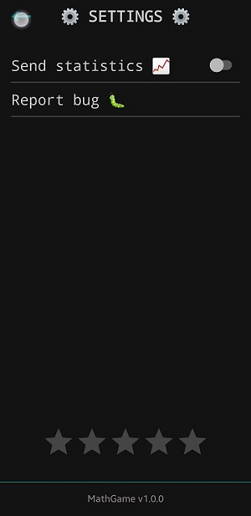

### Игра - UI

#### Загрузка
* Происходит при первом открытии уровня в рамках одной сессии использования приложения
* Отображается анимированная полоска загрузки
* Никакие нажатия не воспринимаются

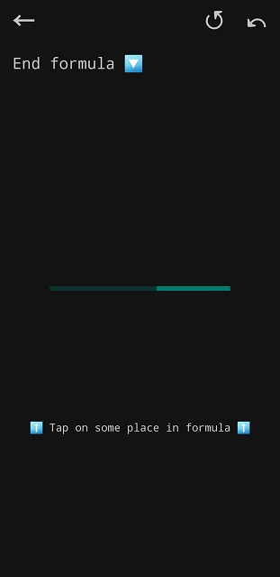
#### Базовое
* Основное состояние игры
* Сверху отображается:
  * Стрелочка влево - кнопка возврата в меню (аналогична Android кнопке "назад")
  * Таймер с оставшимся временем (становится красным, если осталось меньше 11 секунд)
  * Кнопка перезапуска уровня
  * Кнопка "undo"
* Чуть ниже отображается конечная формула - цель данной задачи (ее можно прятать, если мешает....)
* Под конечной формулой находится пространство для сообщений пользователю (например, в начале игры сообщается номер уровня)
* Посередине отображается формула, которую требуется привести к конечной
  * Ее можно увеличивать/уменьшать стандартными жестами для 1 или 2 пальцев
  * По формуле можно (и нужно) тыкать
* Внизу находится пространство для вывода правил либо вспомогательной подсказки, если правил нет или не выбрано место в центральной формуле

|Начало игры|Конечная формула спрятана|Время истекает|  
|---|---|---|  
||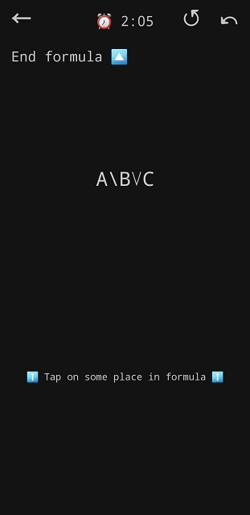|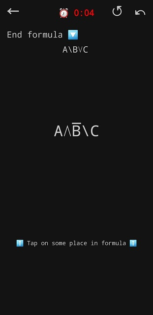|  
#### Выбор подформулы
* Второе состояние по частоте использования после [Базового](#базовое)
* Выбранное место в формуле подсвечивается:
  * Бирюзовым, если есть подходящие правила
  * Желтым, если таковых нет (+ сообщение пользователю)
* Снизу отображается окошко с подходящими правилами (либо подсказка, если правил нет)
  * Правила можно листать и тыкать для применения
* Необязательно выбирать правила именно для данного места в формуле, можно продолжать тыкать в другие места формулы
* Касание любого места, помимо всяческих кнопок и формул, приведет к снятию выделения
* Все остальное как в [Базовом](#базовое) состоянии


#### Выбор правила
* Так отображается выбранное игроком правило
* После того, как игрок отпускает палец внутри прямоугольника с правилом, оно непосредственно применяется к выделенному месту в формуле

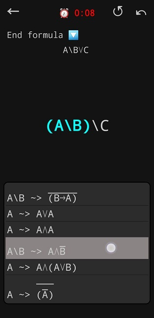
#### Назад в меню
* Так отображается нажатие на кнопку назад

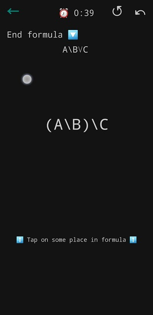
#### Перезапуск
* Так отображается нажатие на кнопку перезапуска уровня

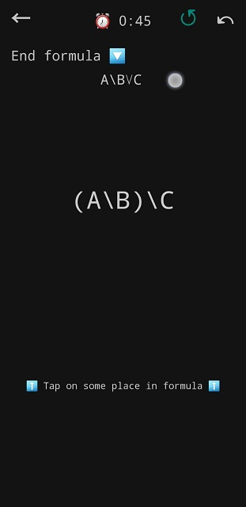
#### Шаг назад
* Так отображается нажатие на кнопку возврата на шаг назад

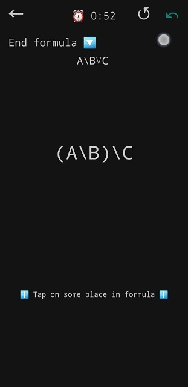
#### Победа
* Окошко содержит следующую статистику:
  * Количество затраченных шагов (может быть нецелым в связи с системой штрафов)
  * Затраченное в секундах время
  * Медалька!
    * Платиновая - если игрок обхитрил учителя и решил за меньшее число шагов
    * Золотая, серебренная и бронзовая - в связи с внутренней системой оценивания
* Данная статистика сохраняется и отображается далее в состоянии ["Уровни"](#уровни)
* Кнопки "menu", "previous", "next" - для возврата в меню, перехода в следующий и предыдущий уровни соответственно
* Затемненный фон и прочие кнопки - не активны 
    

#### Поражение
* Окошко, появляющееся по истечении времени
* Кнопки "menu" и "restart" - для возврата в меню и перезапуска соответственно
* Затемненный фон и прочие кнопки - не активны

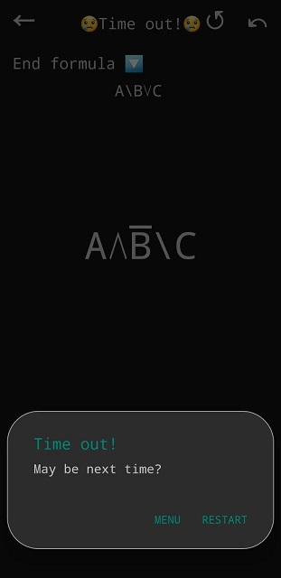

