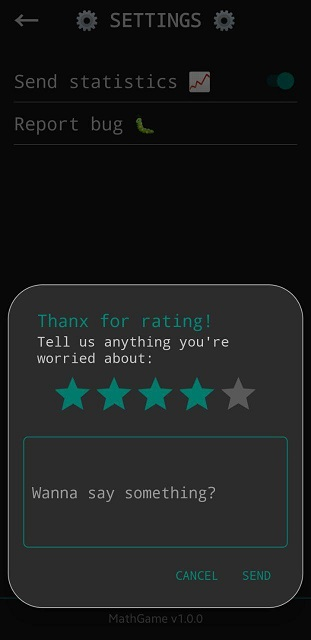

# Описание графического языка

## Содержание
- [Назначение](#назначение)
- [Описание состояний](#описание-состояний)
  - [Уровни](#уровни)
  - [Настройки](#настройки)
  - [Игра](#игра)
- [Описание UI](#описание-ui)
  - [Состояние "Уровни"](#состояние-уровни)
  - [Состояние "Настройки"](#состояние-настройки)
  - [Состояние "Игра"](#состояние-игра)
## Назначение
Назначение игры представим с помощью диаграммы использования:  


  
А для корректного взаимодействия пользователя и игры нам необходим удобный графический язык UI.  
Последний и будет описан ниже!

## Описание состояний
Приложение состоит из 3 экранов:
* экран уровней (он же стартовый)
* экран настроек
* игровой экран  

Таким образом, приложение может находиться в 5 глобальных состояниях, 3 из которых внутриигровые:
  

  
Далее рассмотрим как происходит взаимодействие с пользователем во всех внутриигровых
глобальных состояниях.

### Уровни

Рассмотрим более детально взаимодействие игрока и приложения в глобальном состоянии "Уровни":
  


На данной диаграмме рассмотрены 4 локальных состояния:
* [Авторизация](#авторизация) (Необходима только при первом запуске приложения)
* [Тотальный сброс](#тотальный-сброс) (При желании сбросить все свои достижения)
* [Просмотр уровней](#просмотр-уровней) (Основное локальное состояние)
* [Выбор уровня](#выбор-уровня)

### Настройки

Рассмотрим более детально взаимодействие игрока и приложения в глобальном состоянии "Настройки":



На данной диаграмме рассмотрены 4 локальных состояния:
* [Просмотр настроек](#просмотр-настроек) (Основное локальное состояние)
* [Оценивание](#оценивание)
* [Отправка бага](#отправка-бага)
* [Возврат в меню](#возврат-в-меню)

### Игра
// TODO

## Описание UI
### Состояние "Уровни"
#### Авторизация
* Здесь представлены поля для заполнения
  * Обязательные поля - красные с "!"
  * Необязательные - бирюзовые
* Затемненный задний фон не активен
* Android кнопка "назад" не активна
* Кнопки "exit" и "sign in" - кнопки для выхода и регистрации соответственно


#### Тотальный сброс
* Кнопки "cancel" и "yes" - кнопки для отказа и согласия соответственно
* Нажатие на затемненный задний фон аналогично нажатию на "cancel"
* Нажатие на Android кнопку "назад" аналогично нажатию на "cancel"


#### Просмотр уровней
* Помимо просмотра названий уровней, после прохождения оных можно наблюдать
  картину результатов прохождения (медалька, количество шагов и время)
* Уровни сортируются по сложности и обводяться соответсвтующими цветами:
  * легкие - зеленый
  * средние - желтый
  * сложные - красный
  * интригующе сложные - бордовый
* Красный крестик - кнопка для перехода в состояние [Тотальный сброс](#тотальный-сброс)
* Шестеренка - кнопка для перехода в глобальное состояние [Настройки](#настройки)


#### Выбор уровня
* Выбранный уровень под пальцем пользователя обводится бирюзовым



### Состояние "Настройки"

#### Просмотр настроек
Пока что в настройках можно:
* Выбрать отправлять статистику на сервер али нет бирюзовым рычажком
* Отправить сообщение об ошибке нажатием на милую гусеницу
* Отправить оценку приложения (от 0 до 5 с шагом 0.5 aka "10-балльная система")
  * Выбрать оценку можно ведением по звездочкам (если игрок пребывает в размышлениях)
  * Либо просто нажатием на нужное количество
* Посмотреть версию приложения в самом низу экрана
* Вернуться в меню уровней с помощью
  * белой стрелочки
  * Android кнопки "назад" 
  

#### Оценивание
* Оценку можно менять и на данном этапе!
* В поле вводится любой комментарий к оценке, который игрок сочтет нужным
* Кнопки "cancel" и "send" предназначены для отказа от действия и отправки оценки соответственно
* Нажатие на затемненный фон либо Android кнопку "назад" равносильно "cancel"


#### Отправка бага
* В поле вводится любой комментарий, который игрок сочтет нужным
* Кнопки "cancel" и "send" предназначены для отказа от действия и отправки ошибки соответственно
* Нажатие на затемненный фон либо Android кнопку "назад" равносильно "cancel"


#### Возврат в меню
* Белая стрелочка под пальцем пользователя обводится бирюзовым
* На данном скриншоте можно увидеть отображение отказа от сбора статистики



### Состояние "Игра"

#### Начало игры
#### Время на исходе
#### Победа
#### Поражение
#### Базовое
#### Выбор подформулы
#### Выбор правила
#### Конечная формула спрятана
#### Назад в меню
#### Перезапуск
#### Шаг назад
